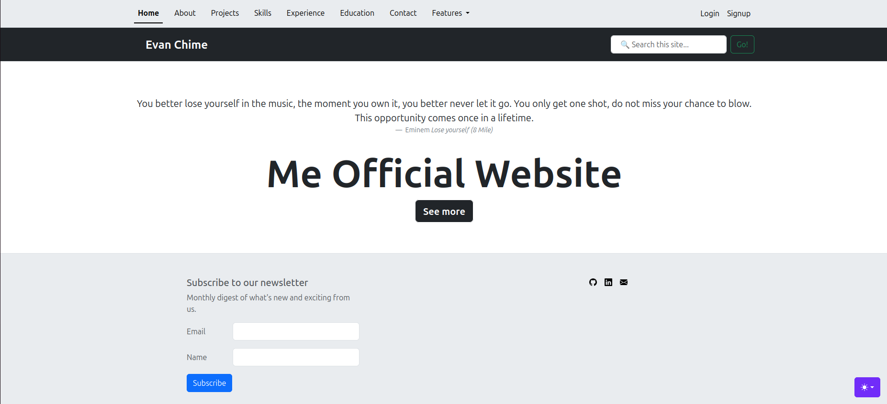
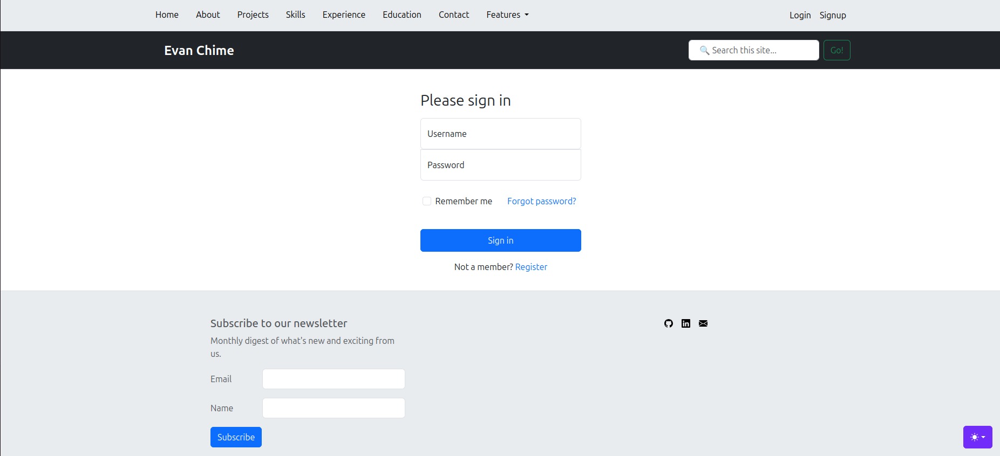
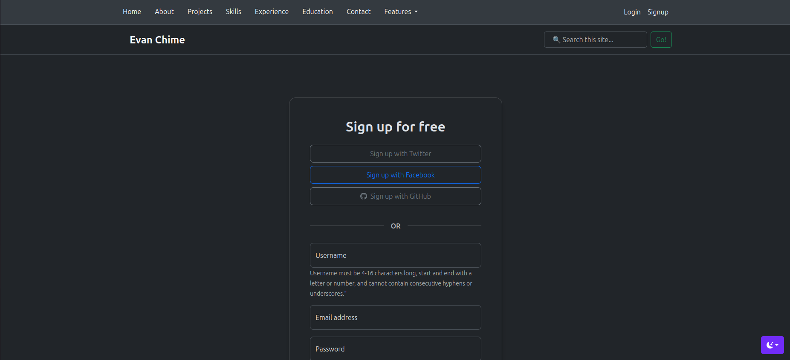
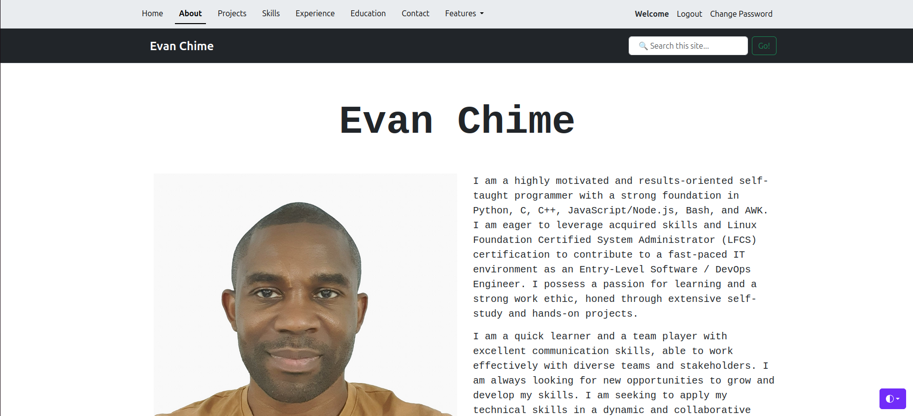

# Me Website

Welcome to my personal website repository! This project contains the source code for my personal website.

## Table of Contents

- [Introduction](#introduction)
- [Features](#features)
- [Installation](#installation)
- [Usage](#usage)
- [Contributing](#contributing)
- [Environment](#environment)
- [License](#license)

## Introduction

This website serves as my personal portfolio and blog. It showcases my projects, skills, and thoughts on various topics.

## Features

- Personal portfolio
- Different color themes
- Login form
- Signup form
- Password change and reset 
- Blog and poll section
- Responsive design
- Search box for specific keywords (Coming soon)
- Contact form for feedback (Coming soon)
- Newsletter subscription form (Coming soon)
- Third-party sign-up (Coming soon)

## Installation

To run this project locally, follow these steps:

1. Clone the repository:
    ```bash
    git clone https://github.com/evanchime/me_website.git
    ```

2. Navigate to the project directory:
    ```bash
    cd me_website
    ```

3. (Optional) Set up a Python virtual environment (Ubuntu example):
    ```bash
    sudo apt install python3-venv
    python3 -m venv my_env
    source my_env/bin/activate
    ```

    Deactivate when done:
    ```bash
    deactivate
    ```

4. Install dependencies:
    ```bash
    pip install -r requirements.txt
    ```

## Usage

### Prerequisites

#### Local Development (Without Docker)
- Database (SQLite by default; adjust for PostgreSQL/MySQL if needed)
- Create a `.env` file in the project root (use the template in [ENVIRONMENT](ENVIRONMENT.md)).

#### Docker Development
- Docker Engine
- Docker Compose
- Nginx Configuration

### Local Development
1. After [Installation](#installation), create a `.env` file in the Django project directory (use the template in [ENVIRONMENT](ENVIRONMENT.md)).
2. Update `.env` with your settings (e.g., `SECRET_KEY`, `DEBUG=True`).
3. Navigate to the Django project directory.
4. Run migrations:
   ```bash
   python3 manage.py migrate
   ```
5. Start the development server:
   ```bash
   python3 manage.py runserver
   ```
6. To create superuser:
   ```bash
   python3 manage.py createsuperuser
   ```

### Docker Development
1. After [Installation](#installation), create a `.env` file in the project root (use the template in [ENVIRONMENT](ENVIRONMENT.md)).
2. Update `.env` with your settings (e.g., `SECRET_KEY`, `DEBUG=False`).
3. Don't forget to uncomment image/build section respectively in the compose file

#### Docker Compose
1. Starting:
   ```bash
   docker compose start
   ```

   Or, to run the image:
   ```bash
   docker compose up [-d]
   ```

   Clean up old containers/networks:
   ```bash
   docker compose down && docker compose up
   ```

   Remove containers, networks, and volumes:
   ```bash
   docker compose down -v && docker compose up
   ```

   Full cleanup (containers, networks, volumes, and images):
   ```bash
   docker compose down --volumes --rmi all && docker compose up
   ```

2. Building:
   ```bash
   docker compose build && docker compose up [-d]
   ```

   Rebuild without cache:
   ```bash
   docker compose build --no-cache && docker compose up
   ```

   Clean up before rebuilding:
   ```bash
   docker compose down --volumes --rmi all && \
   docker compose build --no-cache && \
   docker compose up
   ```

4. Stopping:
   ```bash
   docker compose stop
   ```

5. Other common commands:
   ```bash
   # Apply migrations
   docker-compose exec web python3 manage.py migrate

   # Create superuser
   docker-compose exec web python3 manage.py createsuperuser

   # View logs
   docker-compose logs -f [service]
   ```

### Access the Application

After starting the development server, open your browser to: 

- **Local Development (Without Docker)**: [http://localhost:8000](http://localhost:8000)

After starting the containers, open your browser to:

- **Local Development**: [http://localhost:8080](http://localhost:8080)
- **Production**: `https://your-domain.com` (requires additional SSL configuration)

> **Note**: The default port 8080 is defined in the Docker Compose configuration. Modify the `nginx` service ports in `compose.yaml` if you need to use a different port.

### Screenshots






## Environmeent

For detailed documentation of all environment variables, see [ENVIRONMENT](ENVIRONMENT.md)

## Contributing

Contributions are welcome! Open an issue or submit a pull request for improvements or bug fixes.

## License

This project is licensed under the MIT License. See the [LICENSE](LICENSE.md) file for details.
